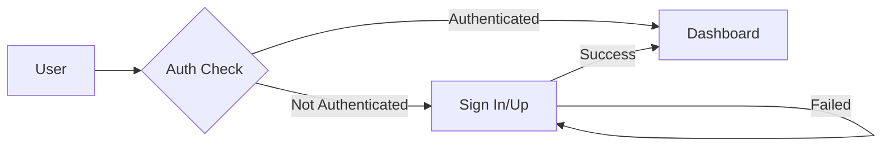

# Swarn Foundation - Education Platform Architecture

## Overview

The Swarn Foundation platform is a Next.js-based web application designed to facilitate educational support and management. The application follows a modern, component-based architecture with server-side rendering capabilities.

## Directory Structure

```
src/
├── app/                    # Next.js 13+ App Router
│   ├── (auth)/            # Authentication routes (route group)
│   │   ├── _components/   # Shared auth components
│   │   ├── _types/       # Auth-related types
│   │   ├── sign-in/      # Sign in page
│   │   ├── sign-up/      # Sign up page
│   │   └── reset-password/# Password reset
│   ├── dashboard/         # Dashboard features
│   │   ├── all-users/    # User management
│   │   ├── my-organisations/ # Org management
│   │   └── create-organisation/
│   ├── api/              # API routes
│   └── page.tsx          # Landing page
├── components/           # Shared UI components
│   ├── button.tsx       # Button component
│   └── card.tsx         # Card component
├── db/                  # Database and auth configuration
│   └── auth.ts         # Authentication setup
└── utils/              # Utility functions
    └── auth-client.ts  # Auth client utilities
```

## Core Features

### 1. Authentication System
- **Implementation**: Uses a custom authentication system
- **Key Components**:
  - Sign In/Sign Up pages
  - Password reset functionality
  - Social authentication (Google)
  - Session management

### 2. Dashboard
- **Features**:
  - User profile management
  - Organization management
  - User role management
  - Activity tracking

### 3. Organization Management
- **Capabilities**:
  - Create organizations
  - Manage organization members
  - View all organizations
  - Personal organization management

## Technical Architecture

### 1. Frontend Architecture
- **Framework**: Next.js 13+ with App Router
- **Styling**: Tailwind CSS with custom components
- **State Management**: Server components with client islands
- **Components**:
  - Atomic design principles
  - Shared component library
  - Responsive design

### 2. Authentication Flow


### 3. Data Flow
- Server-side rendering for initial data
- Client-side updates for dynamic content
- API routes for data mutations

## Security Measures

### 1. Authentication Security
- Secure session management
- Protected API routes
- CSRF protection
- Rate limiting

### 2. Data Protection
- Input validation
- XSS prevention
- Secure headers
- Environment variable protection

## Component Guidelines

### 1. UI Components
- Use TypeScript for type safety
- Follow accessibility standards
- Implement responsive design
- Maintain consistent styling

### 2. Page Components
- Implement proper error boundaries
- Handle loading states
- Include proper meta tags
- Follow SEO best practices

## API Structure

### 1. Authentication APIs
- `/api/auth/*` - Authentication endpoints
- Protected route middleware
- Session management
- Token handling

### 2. Organization APIs
- Organization CRUD operations
- Member management
- Role-based access control
- Activity logging

## Development Guidelines

### 1. Code Style
- Use TypeScript for all components
- Follow ESLint configuration
- Implement proper error handling
- Add JSDoc comments for complex functions

### 2. Testing Strategy
- Unit tests for utilities
- Component testing
- Integration tests for auth flows
- E2E testing for critical paths

### 3. Performance Considerations
- Optimize image loading
- Implement proper caching
- Use proper code splitting
- Optimize API calls

## Deployment

### 1. Environment Setup
- Development environment
- Staging environment
- Production environment
- Environment variable management

### 2. Build Process
- Next.js build optimization
- Asset optimization
- Cache management
- CDN configuration

## Future Considerations

### 1. Scalability
- Implement proper caching
- Database optimization
- API rate limiting
- Load balancing

### 2. Monitoring
- Error tracking
- Performance monitoring
- User analytics
- Server monitoring
